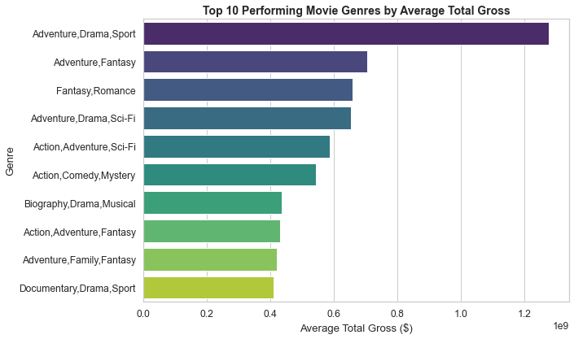
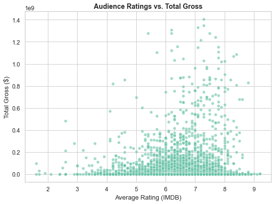

# MOVIE SUCCESS ANALYSIS PROJECT 

## OVERVIEW 
This project explores the entertainment industry as there has been rapid evolving as major plays aim to produce original contents for streaming Platforms. In the project, we leveraged movie revenue data from Box office Mojo and IMDB database to analyze the movie ratings and characteristics.  The objective of this project is to conduct a comprehensive exploratory data analysis to identify patterns, relationships and factors contributing towards a movie success within the entertainment industry. The insights and findings gathered in this project can be transalted to actionable recommendations for companies within the industry. 

## Business Understanding 
A company plans to launch a new movie studio  but has no information on the performance of various movies at the box office. For the company to remain competitive, the company needs an understanding on best movie performances to make informed investment decisions. This project will explore historical data such as movie ratings, movie revenue and movie characteristics to guide the company on which movie studio to invest in and the type of films to produce. 

### Project Goal
Goal: To identify the key factors that drive movie box office success and to provide data driven insights to guide in the new movie studio and production venture. 

###  Business Questions 
1. which are the highest performing movie genres?
2. What is the impact of audience ratings on box office performance?
3. What are the key factors that determine movie success? factors such as runtime, genre and release timing 
4. How have the box office performance changed over the years? 

## Data Understanding and Analysis 

To achieve the goal of providing data driven insights on a new movie studio venture, two datasets were used in the project. 
1. bom.movie_gross.csv.gz — Box Office Mojo data with revenue information.
2. im.db — IMDB SQLite database containing movie information such as titles, genres, and ratings.

The two datasets are relevant in the project as :
1. BOM has revenue information for which revenue is one of our target variable
2. IMDB contains movie attributes which are more important for our objectives

First, the IMBD database contains multiple tables, however, only the movie_basics and movie_ratings contained relevant data for our analysis. The data on movie_ratings was good as did not contain duplicates or missing values but the movie_basics contained missing values which reqiuired cleaning by dropping rows or imputing . On the other hand, the Bom revenue data was messy and required cleaning such as dealing with missing values and duplicates. 

Eventually, we created a merge between the bom revenue dataset and the imbd datasets to generated a cleaned dataset for our analysis. The merge generated a data with 3109 rows and 13 columns. 

### Visualizations 
1. Top Performing Genres

From the visualization above, Adventure and Action-based genres dominate box office performance, especially when combined with elements of Drama, Fantasy, or Sci-Fi. These hybrid genres consistently attract large audiences and deliver the highest average total gross, exceeding $1 billion in some cases. This suggests that audiences prefer visually engaging, emotionally compelling, and high-concept stories making Adventure Drama and Action–Fantasy films the most profitable focus areas for a new movie studio

2. Ratings as a factor in  Box Office success

The scatter plot shows a positive relationship between audience ratings and total box office gross. Movies with ratings between 6 and 9 on IMDB tend to earn significantly higher revenues, while poorly rated films (below 5.0) rarely achieve major financial success. This indicates that audience satisfaction and perceived quality strongly influence a movie’s commercial performance films that resonate well with viewers are more likely to generate higher box office returns.

3. Runtime as a factor in Box office success

The visualization below reveals a slight positive relationship between runtime and total box office gross. Movies with runtimes between 90 and 130 minutes generally achieve higher earnings, suggesting that audiences prefer films that are long enough to develop a story but not excessively lengthy. Extremely short or overly long films tend to earn less, indicating that finding an optimal runtime balance is key to maximizing box office performance. 

4. Top performing Studios

The visualizations shows that a few major studios dominate the box office market. Studios such as HC, P/DW, and BV achieve the highest average total gross, far outperforming others. This suggests that established studios benefit from larger production budgets, strong marketing strategies, and brand loyalty. Meanwhile, smaller studios like Sony, Universal, and Paramount still maintain consistent performance but on a smaller scale. Overall, studio reputation and financial capacity play a significant role in driving box office success

## Conclusion
To conclude,  exploratory data analysis reveals that movie success is largely driven by genre choice, audience ratings, and production strategy. High-grossing films typically belong to popular hybrid genres, are well-rated by audiences, and have optimal runtimes. These findings suggest that creativity, quality, and data-driven decision-making should guide the company’s new movie production strategy.
